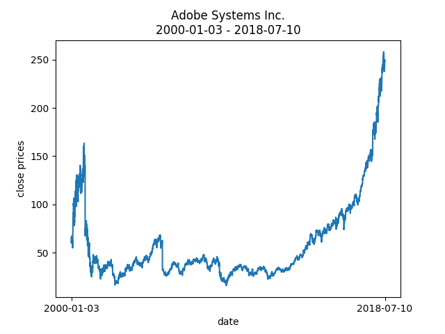

# ProjectX Stock Data Exemplary code
This exemplary stock data project gives an insight into some parts of the projectx stock package:
* Data import through alphavantage API (https://www.alphavantage.co/), data cleaning and storage at filesystem or in a postgres database
* Feature Calculations for each days stock prices
* Training of a RandomForest model and next days price trend predictions
* Examples of: config usage, unittests, exception handling

## 1. Initialisation.py
Execution of this scripts starts data import through the alphavantage API and creation of a 'Stock' object for each
asset specified in 'resources/market1.txt'. The objects are stored as pickled objects either at filesystem level
(resources/objects) or in a postgres database. If you dont need the postgres database functionality, set 'save_to_database'
to False in config/config.ini and make sure that 'load_objects_from' is set to 'filesystem'. In case of postgres usage,
the database credentials need to be specified in the config file.

## 2. ml_model.py
This is a straightforward script that loads all stocks specified in 'resources/market1.txt', calculates three stock
features for each day of the price time series and finally feeds these observations to a RandomForest Machine Learning
Model. The trained model is immediately used to predict stock trends for a separate test set, the accuracy is calculated
and a confusion matrix shown. All these information are simply displayed in the Terminal's output window.

## 3. Data
The imported stock price data is stored as pandas DataFrames with four columns for the open, high, low and close prices 
of each day, though in this project only the close prices are used. Here is an exemplary plot of the ADBE (Adobe Systems)
stock time series.

## RandomForest results
Here an exemplary output of 'ml_model.py' is shown:
~~~~
Number of observations in the training data: 12033
Number of observations in the test data: 2063

features: ['close_price_ratio' 'slope' 'deviation_from_mean_over_std']

accuracy_exact: 0.335918565196316
accuracy_trend: 0.6984973339796413

confusion matrix:
Predicted Evaluation  +0  -0   -1   -2   1   2
Real evaluation                               
+0                     0   0    1    1   0   0
-0                     0   1   57   39   1  11
-1                     2  18  366  286  13  55
-2                     0  16  315  293  10  71
1                      0   1   63   49   1  12
2                      0   7  168  169   5  32

feature importance:
[('close_price_ratio', 0.3356285538228138), ('slope', 0.33453631389307936), ('deviation_from_mean_over_std', 0.32983513228410677)]
~~~~

Altogether, about 12000 observations were used to train the model, while the test
dataset contains 2063 entries.

The features considered by the model are shown next, in this case three features
are used.

The value of accuracy_exact signifies the ratio of correctly predicted categories, in this
case about 33%. For stock price predictions, it might be enough to predict the trend (increasing or decreasing prices).
The value of accuracy_trend evaluates how well the model predicts the trend, in this case in about
69% of the test cases the trend was predicted correctly, which is already quite a good number considering the
relatively simple feature used.

Finally, we take a look at the feature importance, since a feature might be the dominant factor for predictions, or
another might only influence the evaluation slightly. In this case, each feature has an importance of 33%, so all of them are
equally important for predicting. A correlation test between the features would be of interest to assure that 
they have an independent impact on the predictions. 